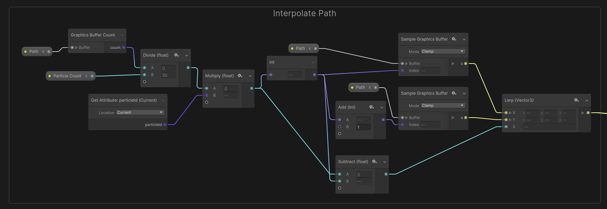

# Unity-Pathfinding-3D
A blogpost-repository about how to do pathfinding in 3D using a sparse voxelisation octree (SVO) with a specialised A* pathfinding algorithm using Unity in C#.

## Introduction
Have you ever wanted had a 3D world where you needed some sort of pathfinding that would NOT just work on the surface of the world but EVERYWHERE? If your answer is a definite YES (or you are just curious anyway) you came to the right place. Whether you want to navigate airplanes, spaceships, birds, or anything with free movement from a start to an endpoint, finding a path in 3D can be challenging, especially if avoiding obstacles is a primary concern. In this blog post's case, we will walk through the logic behind building a fast framework for finding paths in 3D in a constrained environment (a finite 3D space with non-traversable objects in it).

### What this tutorial IS and IS NOT
In this tutorial we will be covering the construction of a sparse voexlisation octree as well as the traversal of it using an optimised A* pathfinding algorithm. The techniques presented will only work for static environments, meaning that dynamic obstacle avoidance must be handled separately which is NOT covered in this tutorial. However, if you know how to do dynamic obstacle avoidance you can use the framework described in this tutorial to handle the static pathfinding and then just build your dynamic obstacle avoidance framework on top of it without a problem. If you want to know about the topic of dynamic obstacle avoidance I recommend reading up on **Optimal Reciprocal Collision Avoidance** (ORCA).

## The problem to solve
The game [Ruins of the Lost](https://portfolio.fh-salzburg.ac.at/projects/2022-ruins-of-the-lost) wanted to introduce a ranged weapon that could automatically search for its targets when fired without the need of aiming at the targets. As part of the solution, an automatically triggered lightning emitter and a bow shooting enemy-seeking chain lightnings were desired.

## Pathfinding
Usually, pathfinding in 2 dimensions (eg. on the surface of a 3D world) is solved by baking a navmesh and using navmesh-agents, which is a simple task in unity. How would you bake a navmesh in 3D? There is not a surface to follow, as the volume of the free space in the world is the medium to be traversed. So let us introduce a spatial tree structure, as is common for other game engine (sub-)systems like physics for example. Let us define the following requirements for that structure:
* It must be **fast** to traverse the structure.
* It must be memory efficient, as we want to support pathfinding in large environments.

Let us consider a regular 3D-Grid with uniform spacing first. This would be the trivial solution to the problem, as you would just subdivide the world in grid cells with a given size and dimensions and check whether any static (geometric) objects overlap each cell (more on that later). It would be reasonably fast to traverse this structure, as any cell can be accessed in constant O(1) time. However, often times (especially for large, open worlds) a lot of space is unoccupied by any geometry, but a regular grid allocated a cell regardless of any overlap with geometry. This not only leads to excessive memory requirements to have a uniform grid for a large space, it also leads to worse pathfinding runtime because most cells are empty but can not be skipped in traversal. Introducing:

## The **S**parse **V**oxelisation **O**ctree
An octree is a relatively simple spatial data structure that splits a parent space into eight child spaces each time a subdivision is required. **Sparse** in this context means, that only certain space (in our case space that is occupied at least in part) is actually allocated as a child node in the octree. The voxelisation part means, that one voxel (the smallest space unit we define for pathfinding) is the smallest space the octree can subdivide to. This also means for our case, that any occupied voxel inserted into our octree will immediately cause all subdivisions necessary to embed it into the lowest level of the octree. This type of octree is advantageous for our use case, because it satisfies the requirements very well:
* It is reasonably fast to be traversed, as accessing any (voxel-)node  inside the tree has guaranteed O(log n) logarithmic time complexity (even better if subsequent traversal for neighbouring nodes is done from a starting node instead of the root). By nature of having much fewer nodes than a uniform grid has cells, traversal is sped up because fewer nodes cover the whole space; therefore, requiring less traversal time.
* It is very memory efficient, as large unoccupied space is not stored explicity but by the fact that no node is allocated for that space. On top of that, large occupied space can also be reduced into bigger occupied nodes if we remove the constraint of a node always being as small as a voxel.

## The overlap check
Now that we defined our data structure, we need to determine whether a voxel is occupied or not in order to insert it into the octree. This is done by performing the overlap check as proposed by Schwarz and Seidel (see Sources below). To make the curious reader's life easier, an implementation (with some helpful comments) of their overlap check is provided [here](https://gist.github.com/Gornhoth/d3ab60d40689148e5a5f9a5566259d51). Just copy this file into your Unity project, add it onto a gameobject in a scene, and drag the reference to a triangle (or a whole mesh like the default cube for example) including its transform onto the script's serialised fields the editor (Note: If you use a whole mesh, only the first triangle will be visualised with this script). With the maths behind it in place, we can traverse a whole mesh (or several meshes) and set the cells of our (currently still uniform grid) world to occupied if a triangle overlaps the cell. This results in a densely packed voxel array where each set _bit_ indicates an occupied voxel (the index of the voxel can be translated back into grid space as shown in the code). The occupied cells can now be inserted one by one into the octree, resulting in our sparsely populated voxel octree over a given set of triangles.

## The A* algorithm
To traverse your octree, you can just implement the A* pathfinding algorithm as seen on Wikipedia with a small but important change: The cost of a neighbour is NOT weighted by the distance to its predecessor, but just incremented by 1. This leads to a speedup in the pathfinding step because bigger neighbouring nodes are now prefered so fewer nodes will be traversed (usually). This idea was described by Dan Brewer in the GDCVault talk linked below (in Sources). If you do not want to have this behaviour (and the associated speedup) you can just go with the default implementation instead.

## Optimisations and configuration
The algorithm for overlap checking with the triangles can be easily implemented in a compute shader to massively speed up the process of voxelisation. I recommend constructing the octree in a normal C# script on the CPU afterwards, because octree construction on the GPU is not trivial in my opinion. Additionally, I recommend you think about the problem domain carefully in order to get the maximum performance for the minimal cost (memory, construction time, accuracy/resolution). For example, if you can get away with a smaller grid size (or bigger cell size) for the voxelisation step without sacrificing too much accuracy, do it to save memory and traversal time (and construction time). Also, if you can construct the octree during design time and just deserialise it when needed during playing, you should do it in order to avoid having to dynamically construct it (if there are no dynamically changing elements in your game that influence the outcome, eg. procedural terrain). Another thing you can consider is asynchronously constructing (or loading in) octrees for separate areas of your game on demand. This has two benefits: 1. You need less memory because only currently active areas' octrees are loaded. 2. By splitting your world into several smaller areas, you can achieve even better results in size and traversal time because often times those areas do not need interconnected pathfinding anyway (think of separate rooms in a roguelike for example). Also please be mindful of the data you apply this solution on: If your world has many overlapping cells and free cells next to each other in a way that prevents the octree from combinging nodes into larger ones, you might be better off just using a uniform grid because it suits the problem domain better. And finally: Don't voxelise what you don't need in the pathfinding. In the example of Ruins of the lost, I excluded the ground floor (as no projectile/lightning would go lower than that and the elevation level stays the same throughout the game) as well as all objects outside of the playable area. Additionally, i excluded things like foliage, that were defined to be penetrable by projectiles.

Combining some of these optimisations, Ruins of the Lost features an SVO per room that is configured to be just big enough to fit the room inside (usually about 6 to 8 octree levels) with a cell size of 2x2x2 Unity units (because the accuracy of the pathfinding is sufficient with this configuration and we can use half the amount of cells by doing so compared to 1x1x1 cell size) whose voxelisation step is processed completely on the GPU, taking less than 100ms per room for voxelising millions of triangles at the start of the game (could be done asynchronously without but was not needed). The optimised pathfinding elapses to a fraction of a millisecond even for the biggest of rooms making this framework perfectly suitable for the task at hand.

## Bonus Chapter: Interpolating the path found via A* in VFX Graph (with a given amount of particles)

Description: Insert your path into a graphics buffer count node, and divide the result by the amount of particles you want to use. Multiply that result with the current particle ID and then split that result into two separate calculation paths:
* The first converts the result into an int. Now use two Sample Graphics Buffer nodes with the input path and mode = "Clamp" to sample at the int index you just received, and the int index + 1. Let these two results be X and Y for our Lerp node to interpolate between the previous and next particle's position.
* The second calculation path inserts the result into a Subtract node to subtract the int index of the first calculation path from. This results in a float remainder that is now used as interpolation value between X and Y of the first calculation path.

The result of this interpolation method is a point in 3D that is on the path found by the A*.

# Sources
[Getting off the NavMesh: Navigating in Fully 3D Environments](https://www.gdcvault.com/play/1022016/Getting-off-the-NavMesh-Navigating)

"Fast Parallel Surface and Solid Voxelisation on GPUs" by Schwarz and Seidel
